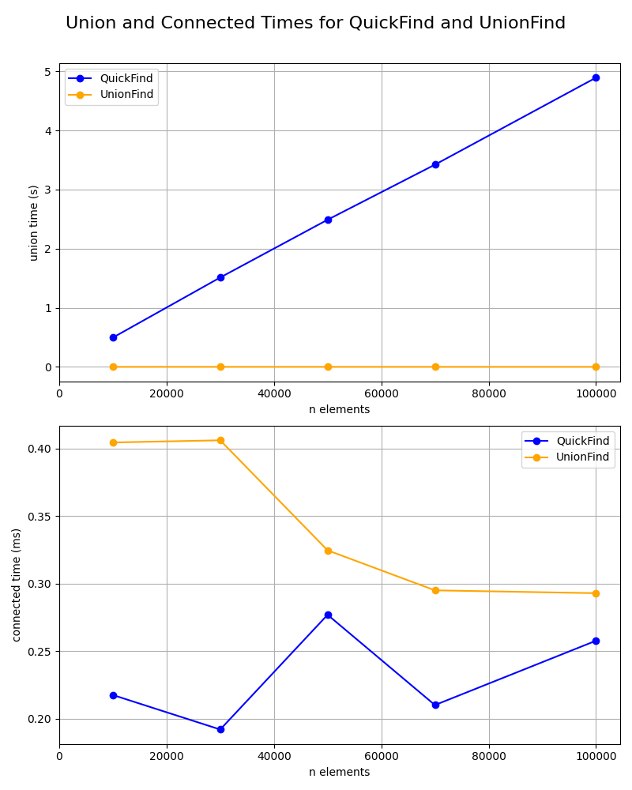
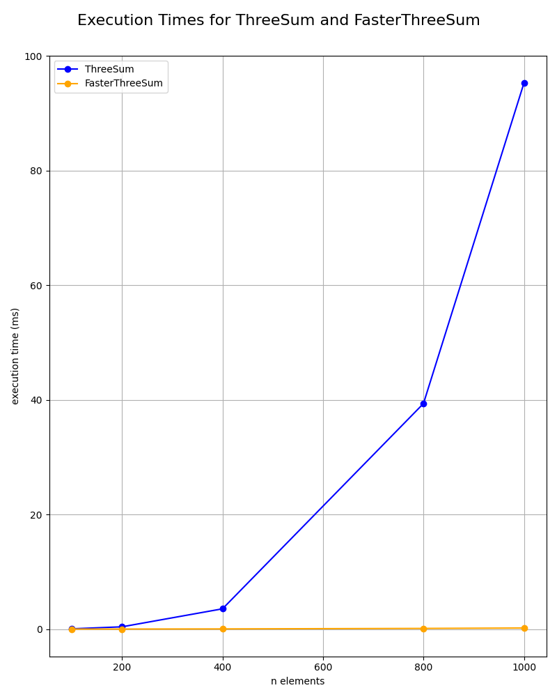

# Assignment 1

We are tasked to implement and analyze the performance of different algorithms. The project is structured into several tasks, each focusing on a specific algorithm or analysis. This is made as part of the course 1DV018 at LNU.

## Requirements

- Python

## How to run

1. Start by installing the required packages.

```bash
pip install -r requirements.txt
```

2. Run the following command in your terminal to execute the main script.:

```bash
python main.py
```

3. OPTIONAL: If you want to generate graphs, run:

```bash
python MatPlot.py
```

To find the graphs, navigate to the `graphs` folder.

## Conclusion in Swedish

### Task 3

Jag har testat med olika storlekar på listorna och sett att tiden ökar med storleken. Detta är i linje med förväntningarna. Jag har också testat med olika antal `unions` och `connected`. Alla är testade med samma antal iterationer för att få en rättvis jämförelse. Förväntningarna innan var inte att det skulle skilja så mycket mellan de olika implementationerna. Men det skiljer en hel del i prestanda. Om vi tar en närmare titt på grafen nedan kan vi se hur `quickfind` presterar i förhållande till `unionfind`.



Kollar vi på Union (den första grafen) kan vi se att `quickfind` presterar sämre än `unionfind` när listorna blir större. Detta är rimligt eftersom den itererar över hela listan för att hitta roten. Medan `unionfind` använder en mer effektiv metod för att hitta roten, vilket förklarar den bättre prestandan.

Kollar vi sedan på Connected (den andra grafen) kan vi se att de båda algoritmerna presterar ungefär lika bra. Det skiljer bara några millisekunder, vilket inte är någon betydande tid i det stora hela.

### Task 6

Jag har även här testat med olika storlekar på listorna och sett att tiden ökar med storleken, framför allt med ThreeSum (O(n³)). Testar vi den algoritmen med 10 000 element tar det väldigt lång tid. Detta är i linje med förväntningarna då ThreeSum använder sig av 3 loopar, vilket ökar tiden eftersom den måste iterera över alla element i listan för varje loop, jämfört med andra algoritmer som har en lägre tidskomplexitet.

FasterThreeSum (O(n² log n)) presterar bättre än ThreeSum. Detta beror på att den använder sig av en sorterad lista samt en smartare algoritm för att hitta tripletter vars summa blir 0. Den sätter första siffran på plats 0 i arrayen och sedan flyttar den andra och tredje siffran beroende på om summan är mindre eller större än 0. Detta gör att den inte behöver iterera över alla element i listan för varje loop, vilket minskar tiden avsevärt.


